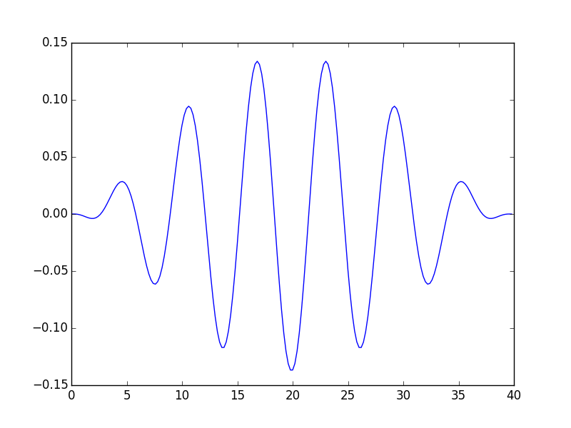
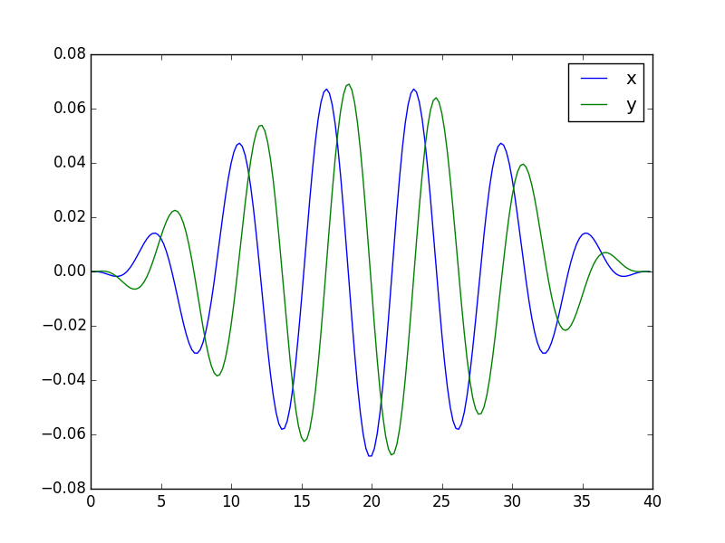
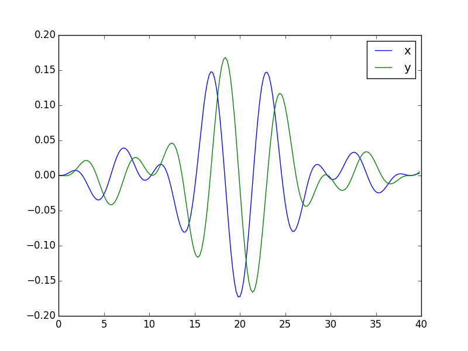
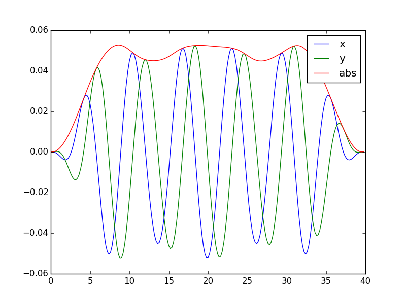
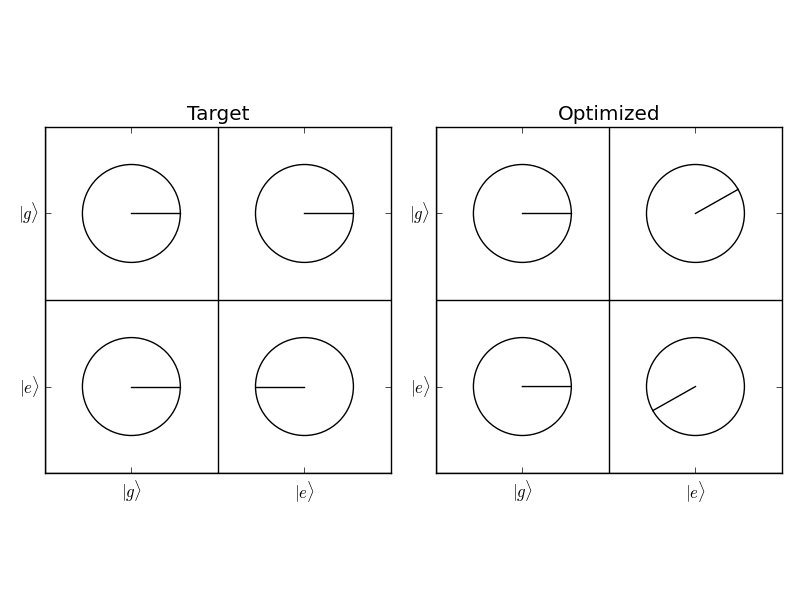
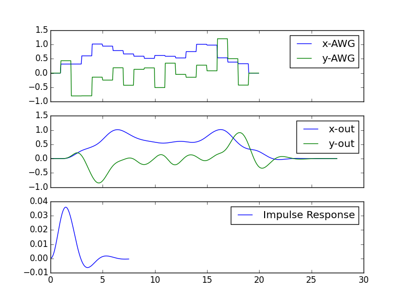
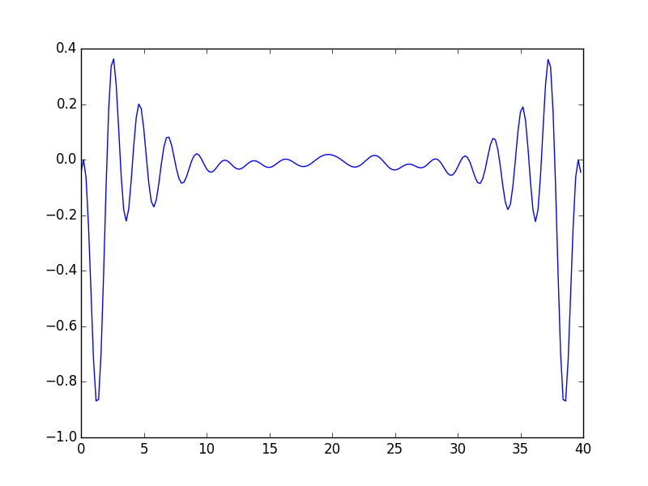
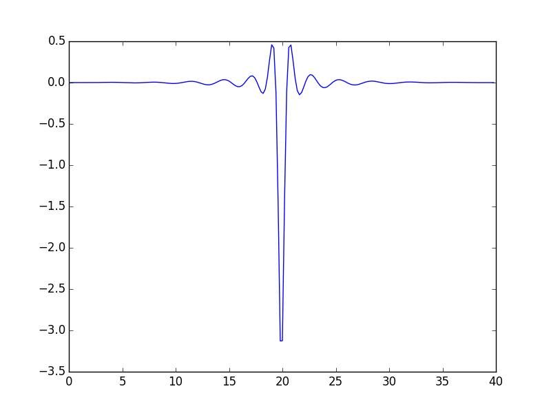

Using pyGRAPE
=============

.. note:: All of the following examples can be found in the examples directory in the main repository

Simple Example
--------------

To start let's see the most basic example. Let's say we want to do a pi pulse on a qubit.

.. literalinclude:: ../examples/pi_pulse.py

Multiple Controls
-----------------

Now let's use two simultaneous drives. One along x and one along y.

.. literalinclude:: ../examples/pi_pulse_xy.py

Enforcing Robustness
--------------------

We can make the output robust by simultaneously optimizing with several setups. In this case,
our setups are identical except for the detuning in the base hamiltonian. Now our goal is to
maximize the sum of the fidelities that come from simulating a given pulse under these different
hamiltonians.

.. literalinclude:: ../examples/pi_pulse_robust.py

State Transfer Formulation
--------------------------

Often, we don't want to optimize a full unitary. For instance, if we have an N-level qudit,
and we want to do a pi pulse on the first two levels, we may not care what the pulse
does to population in the rest of the levels. To set up this problem, we specify a list of
initial states and a list of final states instead of a unitary matrix.

.. literalinclude:: ../examples/pi_pulse_state_transfer.py

.. image:: _static/pi_pulse_state_transfer_ctrls.png

Bounding the Pulse Amplitude
----------------------------
One way of handling constraints is by including penalty terms to the cost. For instance,
we can bound the pulse amplitude by introducing a penalty term proportional to the
amplitude of the pulse. One caveat is that the penalty terms must be differentiable in order
to be compatible with the gradient ascent method.

.. literalinclude:: ../examples/pi_pulse_bounded.py

Allowing Gauge Degrees of Freedom
---------------------------------
If what we are looking to find is not some particular unitary, but rather any unitary
from a continuous family of unitaries, we can make our problem easier by including
a gauge degree of freedom. We then seek to maximize the fidelity of :math:`U_\text{eff}`
to :math:`U_\text{target}`, where

.. math::
    U_\text{eff}(\phi, \varepsilon(t)) = e^{i\phi G} U(T, \varepsilon(t))

With :math:`G` as some hermitian operator. Or even more generally, we can include multiple
operators

.. math::

    U_\text{eff}\left(\{\phi_k\},\varepsilon(t)\right) = e^{i\sum_k\phi_k G_k} U(T, \varepsilon(t))

Here we'll optimize a :math:`\pi/2` pulse where we don't care about the axis of rotation.
This additional degree of freedom comes as an extra :math:`e^{i\phi \sigma_z}` applied
to the final unitary.

.. literalinclude:: ../examples/pi_2_pulse_gauge.py

Accounting for Finite Output Bandwidth
--------------------------------------
The GRAPE model uses a piecewise constant model for the pulse amplitude. When playing a pulse on
real hardware, however, the finite output bandwidth of the AWG results in a pulse which is not
piecewise constant, but rather the convolution of a piecewise constant function and an impulse
response. For longer, smoother  pulses, where the slope between any two adjacent points is small,
this effect can be neglected. If the pulse is short and sharp, it must be accounted for to give
accurate results. We can do this by supplying either a known impulse response, or a filter function
which can generate the response. Additionally, we may need to subsample, i.e. simulate at a finer
resolution than the control point spacing.

.. literalinclude:: ../examples/pi_pulse_subsample.py

Open System Dynamics
--------------------
There are two approaches to handling open system dynamics

1. Use the Lindblad master equation to simulate the full density matrix evolution

.. math::

    \dot{\rho} = \frac{i}{\hbar}[H(t), \rho] + \sum_k \mathcal{D}[c_k](\rho)

2. Use a nonhermitian hamiltonian

.. math::

    \frac{\partial}{\partial t}|\psi\rangle = \frac{i}{\hbar}\left(
    H(t) + \frac{i}{2}\sum_k c_k^\dagger c_k\right)|\psi\rangle

Conceptually the difference between the two comes from whether or not you track the evolution of
states which have undergone an error. Errors transform the density matrix by reducing its purity.
Errors transform the state vector (in the nonhermitian hamiltonian formalism) by reducing its norm.
While the former is more precise, the latter is much easier to compute. Luckily, the latter should
never overestimate the fidelity of a pulse. Which means that a pulse which works well in the
nonhermitian formalism should also perform well in the Lindblad formalism.

Non-Hermitian Hamiltonian
^^^^^^^^^^^^^^^^^^^^^^^^^

In order to include open system dynamics, supply a ``c_ops`` argument to the setup you are using.
This should be a list of (not necessarily hermitian operators) representing possible errors. They
should be scaled by the square root of the error rate, i.e. :math:`\sqrt{\kappa} a`.

.. note:: The hermitian-ness of the hamiltonian provided is automatically detected. When you create
          the setup, a warning should appear letting you know that the arguments were nonhermitian

.. warning:: A different differentiation algorithm needs to be used if the hamiltonian is
             nonhermitian. This algorithm is slower than the hermitian algorithm by roughly a factor
             of 5.

.. literalinclude:: ../examples/pi_pulse_nonhermitian.py

Lindblad Equation
^^^^^^^^^^^^^^^^^

Optimizing pulses within the lindblad open system dynamics is possible in principle. One can transform the equations
governing the GRAPE algorithm as follows.

.. math::

    iH &\rightarrow L = i(H^T \otimes H) + \sum_k c_k^*\otimes c_k -
    \frac{1}{2}\left(\mathbb{I}\otimes c^\dagger c  + (c^\dagger c)^T\otimes \mathbb{I}\right)\\
    \big\{|\psi_k\rangle\big\}_{k\in [n]} &\rightarrow \big\{|\rho_{k,k'})\big\}_{k\in [n], k'\in [n]} =
    \big\{\text{vec}(|\psi_k\rangle\langle\psi_{k'}|)\big\}_{k\in [n], k'\in [n]}

Where :math:`\text{vec}` is the row-stacking operator taking
:math:`\mathbb{C}^{d\times d} \rightarrow \mathbb{C}^{d^2}`, and :math:`\{c_k\}` are the collapse
operators. This is to say that the Liouvillian :math:`L` acts on vectorized density matrices just
as the Hamiltonian :math:`H` acts on states. The computational cost of the open system approach then
comes from the change in effective system dimension from :math:`d` to :math:`d^2`. For small systems
this cost may be bearable, but for large systems it may not.

.. literalinclude:: ../examples/pi_pulse_lindblad.py

